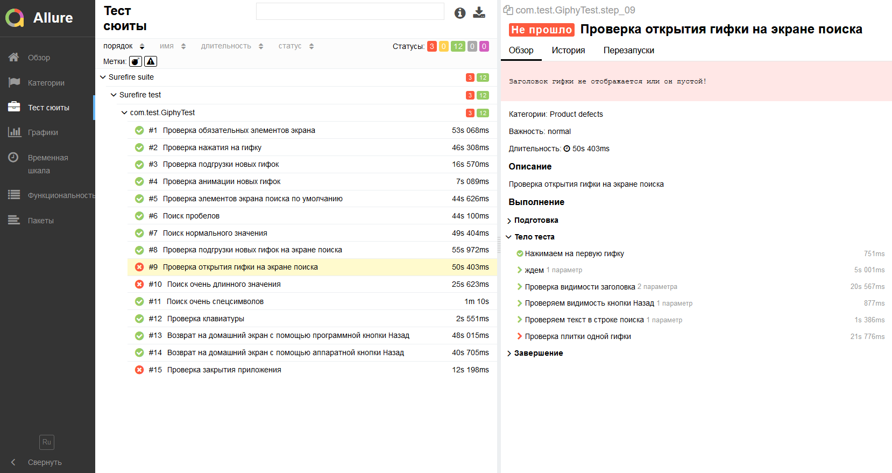

# Selenide + Appium + Allure + TestNG
A test framework for **mobile** automation (Android).
##
### Prerequisites (Windows)
* in **powershell** execute `iwr -useb get.scoop.sh | iex`. May ask permissions
* install allure **cli** with command `scoop install allure`
* install **Node.js** from [link][link]
* install **Appium** with npm command `npm i -g appium`

### Usage:
1. run **Appium** node with `appium` command
2. run a test or a test suite:
* a single test via `mvn test -Dtest=GiphyTest`
* a test suite via `mvn test -Dsuite=testng`
3. run `allure serve target/allure-results` in order to start allure report server
##
## Report example

[link]: https://nodejs.org/en/